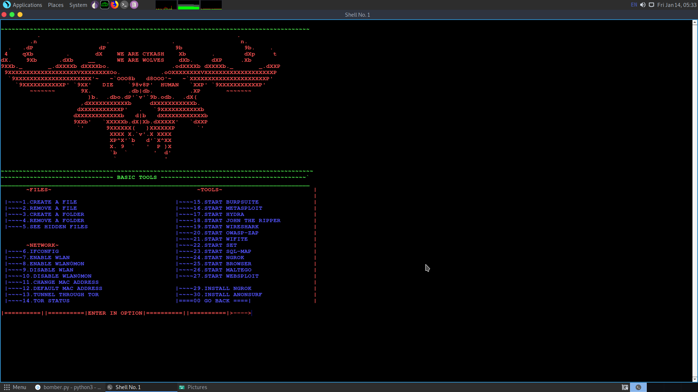

# SCRIPTIE

                        THIS TOOL IS DEVELOPED FOR THOSE WHO WANT TO MAKE THEIR LINUX WORK FAST

                                      
                                               :INSTALLATION FOR LINUX:
                      $apt install figlet toilet python python2 nano boxes neofetch
                      $git clone https://github.com/XPREDX/SCRIPTIE
                      $cd SCRIPTIE
                      $nano main.py
                             put your credentials next yo the commented area in 8 and 9 line and save it
                                $python3 main.py
                                
                                
                 DONT USE THIS TOOL FOR AN UNETHICAL WORK
                 CUZ WE ARE HERE TO HUNT YOU DOWN
                                
     

